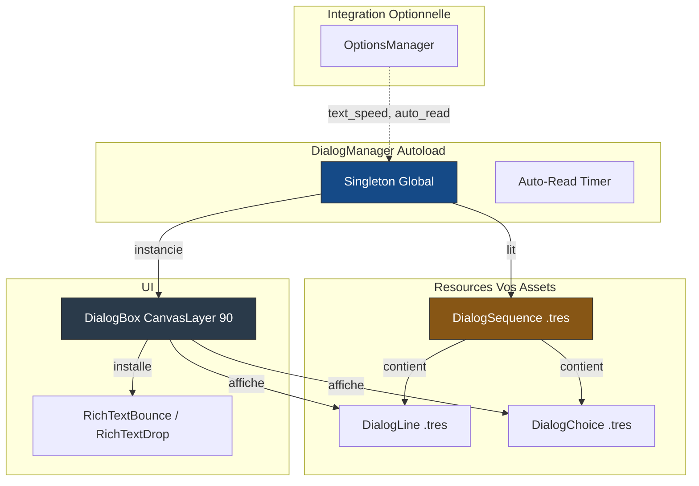

# Soleil Dialog Module

Un systeme de dialogues RPG complet pour Godot 4 : portraits, choix du joueur, animation de texte (typewriter), effets RichText personnalises, et mode auto-read configurable.

---

## Architecture

Le module separe les **donnees** (resources editables dans l'inspecteur) du **flux** (le manager qui enchaine les lignes et gere l'input).



---

## Installation (Git Submodule)

```bash
git submodule add https://github.com/MarioTheKnight/soleil-dialog.git addons/soleil_dialog
```

Puis dans Godot : **Projet > Parametres du projet > Plugins** > cocher **Soleil Dialog**.
L'autoload `DialogManager` est enregistre automatiquement.

---

## Utilisation depuis l'Editeur (Creer un dialogue)

### 1. Creer les lignes de dialogue

1. Clic droit dans votre dossier `assets/` > **Creer un nouveau... > Ressource**
2. Choisissez le type **`DialogLine`**
3. Dans l'inspecteur, remplissez :
   - `character_name` : cle de traduction du nom (ex: `CHAR_HERO`)
   - `text` : cle de traduction du texte (ex: `DLG_GREETING_01`)
   - `portrait` : glissez une texture de portrait
   - `typing_style` : `"typewriter"` (par defaut) ou `"instant"`
   - `portrait_side` : `"left"` ou `"right"`
4. Repetez pour chaque replique

### 2. Creer la sequence

1. Creez une ressource **`DialogSequence`**
2. Glissez vos `DialogLine` dans le tableau `lines` (dans l'ordre)
3. Optionnel : pour proposer des reponses, creez un `DialogPrompt` avec des `DialogChoice`, et pointez `next_dialog_id` de la sequence dessus
4. Donnez un `id` unique (utile pour le branchement)

### 3. Lancer le dialogue en code

```gdscript
@export var greeting_dialog: DialogSequence

func _on_player_interact() -> void:
    DialogManager.play_dialog(greeting_dialog)
```

---

## Utilisation Programatique (GDScript)

### Lancer un dialogue

```gdscript
# Le Game Designer glisse la resource dans l'inspecteur
@export var my_dialog: DialogSequence

func start_conversation() -> void:
    DialogManager.play_dialog(my_dialog)
```

### Ecouter le debut et la fin

```gdscript
func _ready() -> void:
    DialogManager.dialog_started.connect(_on_dialog_started)
    DialogManager.dialog_finished.connect(_on_dialog_finished)

func _on_dialog_started(sequence_id: String) -> void:
    # Desactiver les controles du joueur
    set_physics_process(false)

func _on_dialog_finished(sequence_id: String) -> void:
    # Reactiver les controles
    set_physics_process(true)
```

### Controles du joueur pendant le dialogue

| Action | Effet |
|--------|-------|
| `ui_accept` (Entree/Espace) | Avance a la ligne suivante, ou skip le typing en cours |
| **Clic gauche dans le cadre** | Identique a `ui_accept` (les boutons de choix restent prioritaires) |
| `ui_cancel` (Echap) | Ferme le dialogue (si `can_skip = true` sur la sequence) |

### Effets RichText dans le texte

Le module installe deux effets BBCode personnalises utilisables dans les traductions :

```
# Dans votre fichier CSV de traduction :
DLG_GREETING_01,en,"[bounce freq=5.0 height=4.0]Hello![/bounce] How are you?"
DLG_EARTHQUAKE,en,"The ground [drop delay=0.05 height=20.0]is shaking![/drop]"
```

---

## Le graphe de conversation (v0.2.0)

Une conversation est une **chaine de noeuds** (`DialogNode`), chacun ne faisant qu'une chose :

| Noeud | Fait | Sort par |
|---|---|---|
| `DialogSequence` | parle (des `DialogLine`) | `next_dialog_id`, ou fin |
| `DialogPrompt` | demande au joueur (des `DialogChoice`) | une sortie par option |
| `DialogContest` | remet la main au mini-jeu du jeu hote (phase de cartes), qui **ecrit des variables** | `next_dialog_id` |
| `DialogSwitch` | branche **sans ecran** sur les variables : ses cas dans l'ordre, sinon `default_target_id` | une sortie par cas, plus la sortie par defaut |

Les noeuds se referencent **par id** via le catalogue (`register_sequence` / `register_sequences`, qui acceptent tout noeud), et **n'importe quel noeud peut ouvrir une conversation** — un aiguillage en entree ouvre sur un salut plutot que sur la presentation quand le jeu a seme « deja entendue » dans les variables (voir `dialog_vars_reset`).

Pourquoi des noeuds separes plutot qu'une sequence riche : une sequence qui porte a la fois des repliques, une phase de cartes et des choix fige leur ORDRE (parler, puis affronter, puis choisir). Separes, un choix peut mener a un affrontement dont le resultat decide la reponse — le coeur d'une confrontation sociale — et un outil dessine la conversation exactement comme elle se joue.

> **Ancien contenu** : `DialogSequence.choices` et `card_phase_before_choices` sont **deprecies** mais toujours joues (les choix en ligne valent un `DialogPrompt` implicite apres la derniere ligne, la phase de cartes un `DialogContest` implicite avant). Migrer = deplacer les choix dans un `DialogPrompt` et pointer `next_dialog_id` dessus.

## Resources (Reference)

### DialogNode (base abstraite)

| Propriete / methode | Type | Description |
|-----------|------|-------------|
| `id` | `String` | Identifiant unique dans le catalogue ; la cle des branchements |
| `targets()` | `PackedStringArray` | Les ids que le noeud peut suivre, dans l'ordre de ses sorties, `""` pour « la conversation se ferme » — pour les outils |

### DialogSequence

| Propriete | Type | Defaut | Description |
|-----------|------|--------|-------------|
| `lines` | `Array[DialogLine]` | `[]` | Lignes de dialogue dans l'ordre |
| `next_dialog_id` | `String` | `""` | Noeud joue apres la derniere ligne ; vide = fin de la conversation |
| `can_skip` | `bool` | `true` | Autoriser Echap a fermer le dialogue |
| `choices` | `Array[DialogChoice]` | `[]` | **Deprecie** — utiliser un `DialogPrompt` |
| `card_phase_before_choices` | `bool` | `false` | **Deprecie** — utiliser un `DialogContest` |

### DialogPrompt

| Propriete | Type | Defaut | Description |
|-----------|------|--------|-------------|
| `choices` | `Array[DialogChoice]` | `[]` | Les options, dans l'ordre d'affichage ; aucune disponible = la conversation se ferme (avertissement) |

### DialogContest

| Propriete | Type | Defaut | Description |
|-----------|------|--------|-------------|
| `outcome_mode` | `Mode` | `FRESH` | `FRESH` : ses variables de resultat sont effacees au debut (ce duel seul decide) ; `CUMULATIVE` : elles gardent leur valeur |
| `outcome_vars` | `Array[StringName]` | `[]` | Les variables que le mini-jeu ecrit — ce que `FRESH` efface, ce que les outils proposent aux conditions qui suivent |
| `next_dialog_id` | `String` | `""` | Noeud joue une fois `resolve_card_play_phase()` appele |

Le noeud ne porte **aucune regle du duel** : c'est le contrat, les regles peuvent changer entierement sans que le graphe bouge.

### DialogSwitch et DialogSwitchCase

| Propriete | Type | Defaut | Description |
|-----------|------|--------|-------------|
| `cases` | `Array[DialogSwitchCase]` | `[]` | Essayes dans l'ordre ; le premier qui passe gagne |
| `default_target_id` | `String` | `""` | Suivi quand aucun cas ne passe |
| `DialogSwitchCase.conditions` | `Array[DialogCondition]` | `[]` | Toutes requises ; aucune = passe toujours |
| `DialogSwitchCase.target_dialog_id` | `String` | `""` | Noeud suivi quand le cas s'applique |

### DialogLine

| Propriete | Type | Defaut | Description |
|-----------|------|--------|-------------|
| `character_name` | `String` | `""` | Cle i18n du nom du personnage |
| `text` | `String` | `""` | Cle i18n du texte (supporte les effets BBCode) |
| `portrait` | `Texture2D` | `null` | Portrait du personnage |
| `typing_style` | `"typewriter"` / `"instant"` | `"typewriter"` | Mode d'apparition du texte |
| `speed_multiplier` | `float` (0.1 - 5.0) | `1.0` | Multiplicateur de vitesse relatif au reglage global |
| `custom_voice_blip` | `AudioStream` | `null` | Son de frappe personnalise |
| `portrait_side` | `"left"` / `"right"` | `"left"` | Cote du portrait a l'ecran |

### DialogChoice

| Propriete | Type | Defaut | Description |
|-----------|------|--------|-------------|
| `text` | `String` | `""` | Cle i18n du texte du choix |
| `target_dialog_id` | `String` | `""` | ID de la sequence cible (branchement, via le catalogue) |
| `ends_conversation` | `bool` | `false` | Si `true`, ferme le dialogue sans brancher |
| `preconditions` | `Array[DialogCondition]` | `[]` | Conditions (toutes requises) pour que le choix soit selectionnable |
| `hide_when_locked` | `bool` | `false` | `true` : choix verrouille masque ; `false` : affiche grise |
| `locked_hint_key` | `String` | `""` | Cle i18n ajoutee au choix grise (ex: "requiert 15 intimidation") |

---

## Variables de dialogue et preconditions

`DialogManager.dialog_vars` est une table `Dictionary[StringName, Variant]` **locale au dialogue en cours** (videe au debut et a la fin de chaque dialogue). Le gameplay y ecrit, les preconditions y lisent :

```gdscript
DialogManager.set_dialog_var(&"intimidation", 15)   # ex: effet d'une carte sociale
var value: Variant = DialogManager.get_dialog_var(&"intimidation", 0)
```

Les preconditions sont des ressources **`DialogCondition`** composables, assignees dans l'inspecteur sur `DialogChoice.preconditions` :

| Condition | Passe quand |
|-----------|-------------|
| `VarAtLeastCondition` | `vars[var_name] >= min_value` (absente = 0) |
| `VarEqualsCondition` | `vars[var_name] == expected_value` |
| `VarTruthyCondition` | la variable est presente et vraie (flag) |
| `AllOfCondition` | toutes les conditions imbriquees passent (ET) |
| `AnyOfCondition` | au moins une condition imbriquee passe (OU) |
| `NotCondition` | la condition imbriquee echoue (NON) |

Pour un besoin specifique, sous-classez `DialogCondition` dans votre jeu et implementez `evaluate(vars) -> bool`.

## Branchement par catalogue

Pour qu'un branchement (`DialogChoice.target_dialog_id`, `next_dialog_id`, un cas d'aiguillage) fonctionne, le noeud cible doit etre **enregistre** :

```gdscript
DialogManager.register_sequences([entry_switch, intro, contest, prompt, branch_a, branch_b])
DialogManager.play_dialog(entry_switch)   # n'importe quel noeud peut ouvrir
# Les branchements enchainent dans la meme boite, en conservant dialog_vars.
# clear_sequence_catalog() vide le catalogue ; get_registered(id) relit un noeud.
```

## Semer la memoire du jeu dans les variables

`dialog_vars` est vide au debut de chaque conversation — par construction, rien de persistant n'y vit. Pour qu'un aiguillage ou une condition lise ce que le jeu retient (une sequence deja entendue, un drapeau de la partie), le jeu **seme** dans la table au signal `dialog_vars_reset`, emis juste apres le vidage et avant le premier noeud :

```gdscript
DialogManager.dialog_vars_reset.connect(func(vars: Dictionary) -> void:
    for id in my_save.seen_dialogues:
        vars[StringName("seen:" + id)] = true
)
# Cote contenu : une DialogCondition maison lit vars["seen:<id>"].
```

Les conditions restent pures et testables ; la memoire reste au jeu.

## Hook mini-jeu (phase de cartes)

Quand la conversation entre dans un `DialogContest`, le manager efface ses `outcome_vars` si `outcome_mode` est `FRESH`, emet `card_play_phase_started(contest_id)` et attend. Le jeu affiche alors sa propre UI (ex: une main de cartes sociales), ecrit dans `dialog_vars`, puis rend la main :

```gdscript
DialogManager.card_play_phase_started.connect(func(_id: String) -> void:
    my_social_hand.open()   # les effets de cartes ecrivent dans dialog_vars
)
# Quand le joueur a fini :
DialogManager.resolve_card_play_phase()   # la conversation suit next_dialog_id
```

Ce que le duel a decide se lit ensuite dans un `DialogSwitch` (sans demander au joueur) ou dans les preconditions d'un `DialogPrompt` (options debloquees ou verrouillees).

---

## Effets RichText

### `[bounce]` (RichTextBounce)

Fait rebondir les caracteres individuellement. Ideal pour les exclamations ou les emotions fortes.

```
[bounce freq=5.0 height=4.0]Texte qui rebondit ![/bounce]
```

| Parametre | Type | Defaut | Description |
|-----------|------|--------|-------------|
| `freq` | `float` | `5.0` | Frequence du rebond |
| `height` | `float` | `4.0` | Hauteur du rebond en pixels |

### `[drop]` (RichTextDrop)

Les caracteres tombent un par un depuis le haut, creant un effet de revelation dramatique.

```
[drop delay=0.05 height=20.0]Texte qui tombe ![/drop]
```

| Parametre | Type | Defaut | Description |
|-----------|------|--------|-------------|
| `delay` | `float` | `0.05` | Delai entre chaque caractere (secondes) |
| `height` | `float` | `20.0` | Hauteur de chute en pixels |

---

## Signaux

| Signal | Parametres | Description |
|--------|------------|-------------|
| `dialog_vars_reset` | `vars: Dictionary` | La table vient d'etre videe pour une conversation qui commence : le jeu y seme ce que les conditions doivent voir |
| `dialog_started` | `sequence_id: String` | La conversation commence ; l'id est celui du noeud d'ENTREE (peut-etre un aiguillage) |
| `node_entered` | `node: DialogNode` | Un noeud commence a jouer — l'entree, puis chaque noeud atteint ; `node is DialogSequence` pour ne garder que ce qui parle |
| `dialog_finished` | `sequence_id: String` | La conversation est finie ; l'id est celui du DERNIER noeud |
| `choice_made` | `sequence_id: String, choice: DialogChoice` | Le joueur a retenu une option (avant branchement/fin) — les consommateurs lisent `choice.tags`, texte, cible |
| `card_play_phase_started` | `sequence_id: String` | Un affrontement attend le mini-jeu du jeu hote (voir hook ci-dessus) |
| `card_play_phase_resolved` | `sequence_id: String` | `resolve_card_play_phase()` appele, la conversation va suivre |

### Signaux de la DialogBox (internes)

| Signal | Parametres | Description |
|--------|------------|-------------|
| `line_finished` | aucun | Le typing de la ligne courante est termine |
| `choice_selected` | `choice: DialogChoice` | Le joueur a clique un choix (le manager lit cible/fin/tags sur la ressource) |

---

## Integration avec OptionsManager

Si `soleil_options` est installe, `DialogManager` enregistre **automatiquement** un onglet "Dialog" dans le menu d'options avec 3 reglages :

| Option | Section | Cle | Defaut | Plage |
|--------|---------|-----|--------|-------|
| Vitesse du texte | `dialog` | `text_speed` | `1.0` | 0.1 - 3.0 |
| Auto-read active | `dialog` | `auto_read` | `false` | on/off |
| Vitesse auto-read | `dialog` | `auto_read_speed` | `1.0` | 0.5 - 3.0 |

Les cles de traduction pour l'UI de l'onglet :

| Cle i18n | Usage |
|----------|-------|
| `TEXT_SPEED` | Label du slider de vitesse |
| `AUTO_READ_ENABLE` | Label du toggle auto-read |
| `AUTO_READ_DELAY` | Label du slider de delai |
| `DIALOG_OPTIONS` | Titre de l'onglet |

---

## Dependances

| Module | Requis ? | Integration |
|--------|----------|-------------|
| `soleil_core` | non | Utilise `TranslationServer` directement (compatible avec ou sans Soleil) |
| `soleil_options` | non | Si present : enregistre un onglet Dialog dans le menu d'options |

---

## Structure du module

```text
addons/soleil_dialog/
  plugin.cfg
  soleil_dialog.gd              # Enregistre l'autoload
  autoloads/
    dialog_manager.gd           # Singleton DialogManager
  resources/
    dialog_sequence.gd          # Resource DialogSequence
    dialog_line.gd              # Resource DialogLine
    dialog_choice.gd            # Resource DialogChoice
    conditions/
      dialog_condition.gd       # Base abstraite des preconditions
      var_at_least_condition.gd # vars[x] >= n
      var_equals_condition.gd   # vars[x] == n
      var_truthy_condition.gd   # flag present et vrai
      all_of_condition.gd       # ET
      any_of_condition.gd       # OU
      not_condition.gd          # NON
  effects/
    rich_text_bounce.gd         # Effet BBCode [bounce]
    rich_text_drop.gd           # Effet BBCode [drop]
  ui/
    dialog_box.tscn             # Scene de la boite de dialogue
    dialog_box.gd               # Script UI (CanvasLayer)
```

---

## Organisation Recommandee

```text
MonJeu/
  addons/
    soleil_dialog/              # Le module (ne pas modifier)
  assets/
    dialogs/
      npc_villager/
        villager_greet.tres     # DialogSequence
        villager_line_01.tres   # DialogLine
        villager_portrait.png
      npc_merchant/
        merchant_shop.tres
  game/
    translations/
      dialogs.csv               # Cles : CHAR_*, DLG_*
```

## Pistes de polish

### Systeme de saut (a concevoir)

Aujourd'hui le saut d'un dialogue repose sur deux verrous seulement :

- `DialogManager.cancel_skips_dialog` — un drapeau GLOBAL porte par l'autoload,
  qui survit donc a la scene qui l'a pose. Un ecran qui ne le declare pas herite
  de ce que le precedent a laisse, et la meme touche peut sauter une cinematique
  au premier lancement puis n'avoir aucun effet une fois une autre scene visitee.
- `DialogSequence.can_skip` — par sequence, et donc porte par la donnee : plus
  sur, car aucun hote distrait ne peut le defaire.

C'est binaire et un peu court pour un jeu narratif. Pistes a instruire, sans
decision arretee a ce stade :

- **Saut ligne a ligne** plutot que saut integral (avancer vite sans tout perdre).
- **Saut du seul texte deja vu** — la sequence retient ce que le joueur a lu, et
  seules ces lignes deviennent sautables. Reponse classique au dialogue rejoue a
  chaque partie dans un roguelike.
- **Maintien pour sauter** (appui long) plutot qu'appui simple : evite le saut
  accidentel d'une scene qu'on decouvre.
- **Politique par sequence** (une enumeration a la place de `can_skip`) : jamais /
  toujours / une fois vue.

Besoin exprime par le projet consommateur mercure (2026-08-07), apres qu'un
prologue s'est laisse sauter integralement du fait de l'etat global herite.
